# T3A2: Full Stack App (Part B) Documentation

## MeetMyRoute

### Links

* [Deployed Front-End]()  
* [Deployed Back-End]()
* [GitHub Front-End Repository](https://github.com/MeetMyRoute/T3A2-FullStackApp-PartB-FrontEnd)  
* [GitHub Back-End Repository](https://github.com/MeetMyRoute/T3A2-FullStackApp-PartB-BackEnd)
* [Part A README](https://github.com/MeetMyRoute/T3A2-FullStackApp-PartA)  
* [Trello Board](https://trello.com/b/ay0VQxw7/t3a2-full-stack-app)  

### Libraries & Dependencies

#### Back-End

* `bcryptjs` - Used to hash passwords before storing it in the database to ensures sensitive data like passwords are secure
* `cors` - Used to enable or restrict the different origin/domains that can interact with the back-end API server
* `dotenv` - Used to load environment variables from a `.env` file so ensure that sensitive data like database URIs remain protected
* `express` - Used to build the back-end API and handle HTTP requests
* `express-async-handler` - Used to automatically handle errors in async routes in ExpressJS
* `jsonwebtoken` - Used to generate and verify JWT tokens
* `mongodb` - Used to establish a connection and perform CRUD operations with the MongoDB database
* `mongoose` - Used for data validation, schema creation and model definition for the MongoDB database
* `nodemailer` - Used to send email notifications from NodeJS apps like password reset
* `nodemon` - Used to automatically restart the Node apps when changes are detected during development

#### Front-End

* `axios` - Used to make Promise-based HTTP requests from the front-end and supports async/await usage
* `date-fns` - Used to manipulate and format JS dates
* `dotenv` - Used to load environment variables from a `.env` file so ensure that sensitive data like API URLs remain protected
* `react` - Used for building user interfaces
* `react-datepicker` - Used for data selection in a calendar format
* `react-dom` - Used to render React components and serves as the entry point to the DOM
* `react-router-dom` - Used to handle routing in React apps
* `vite ` - Used to improve the development experience of building user interfaces

### Source Control Methodology
We used GitHub to manage all source control. The project was organised into two separate repositories: one for the front-end and one for the back-end. A new branch was created for each feature and once the feature was completed, it was merged into the main branch to ensure a clean and manageable codebase.

GitHub Screenshots

#### Repositories
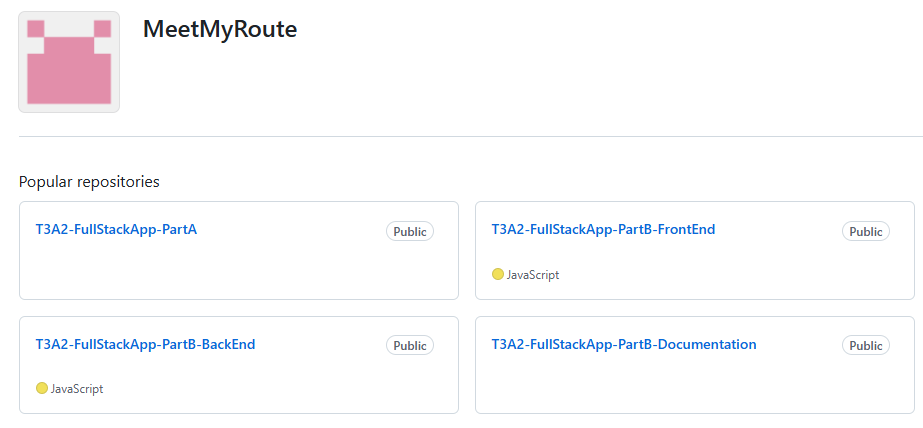  

#### Back-End Branches
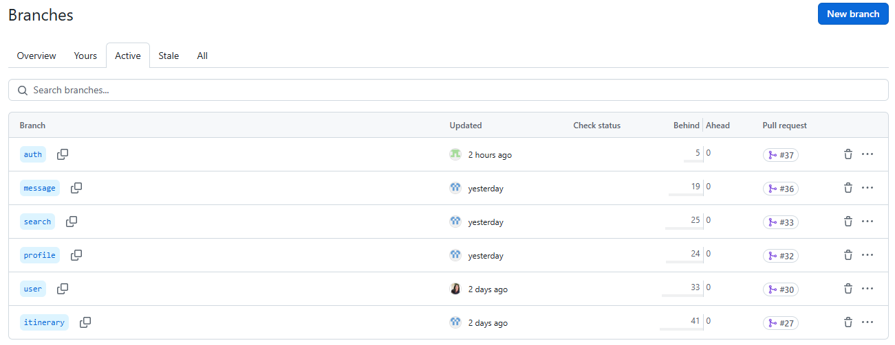  

#### Front-End Branches
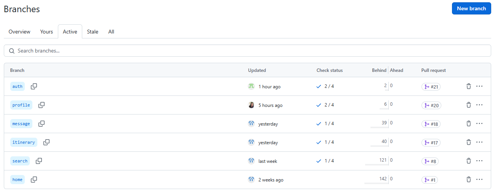  

### Project Management & Task Delegation
Discord was used as our primary platform for communication and Trello for tracking progress. The To-Do list on Trello was organised into Front-End and Back-End tasks. Each card was labelled to identify which feature the task related to and checklists were added to monitor progress and track the remaining steps required to complete each task.

We decided to delegate tasks based on features, ensuring that all team members gained hands-on experience in both front-end and back-end development for their assigned features. This approach helped promote a well-rounded understanding of the entire project and allowed for efficient collaboration.

Trello Board Screenshots

#### 28.11
   

#### 30.11
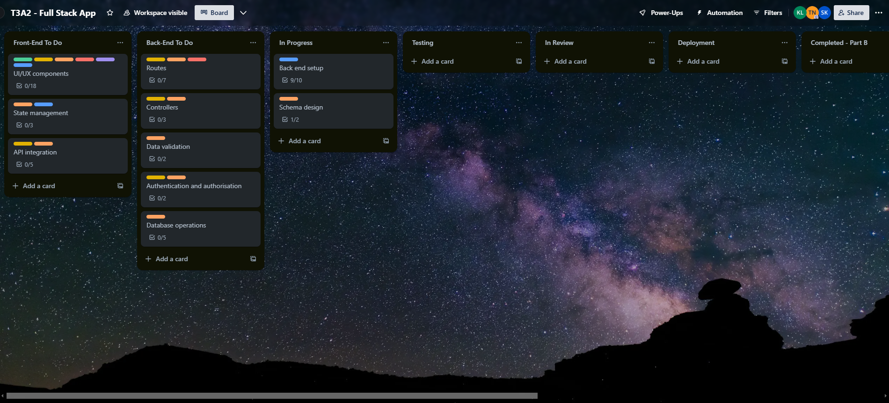 

#### 2.12
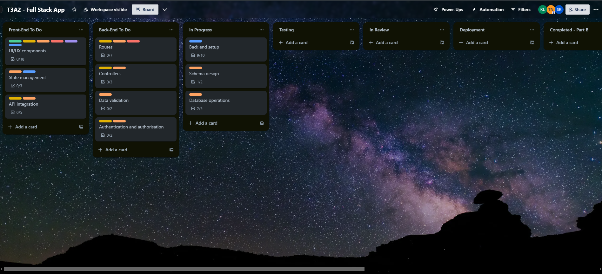   

#### 3.12
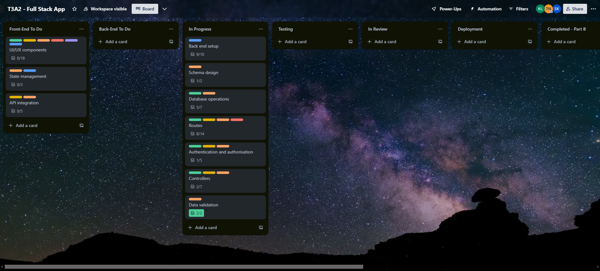   

#### 6.12
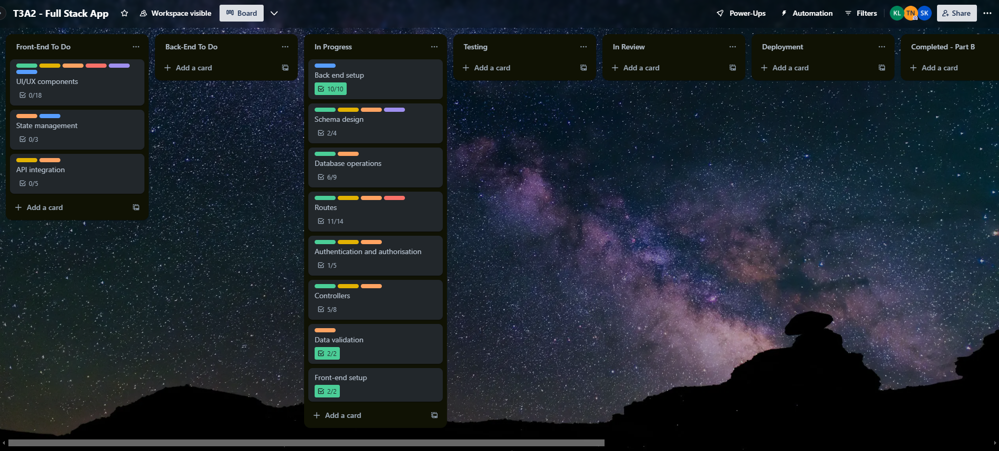   

#### 7.12
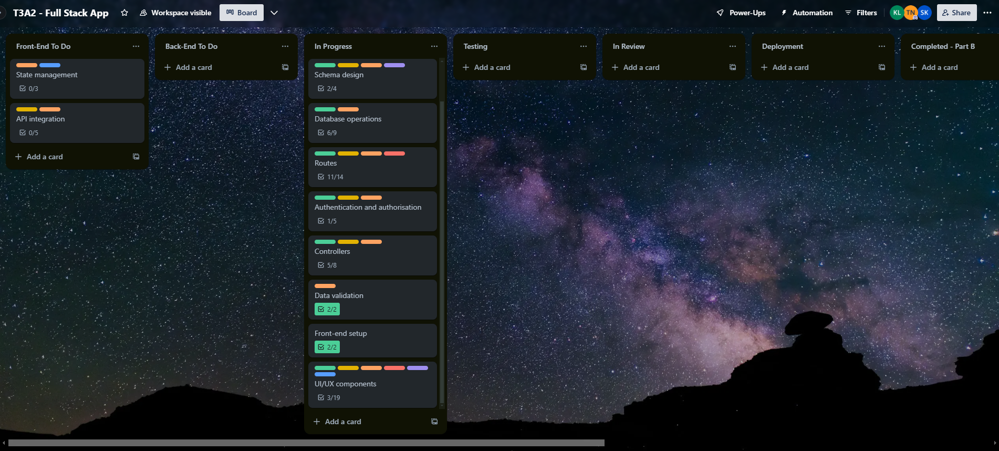   

#### 8.12
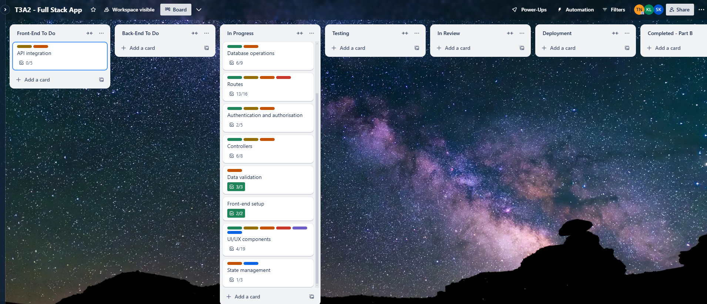

#### 13.12
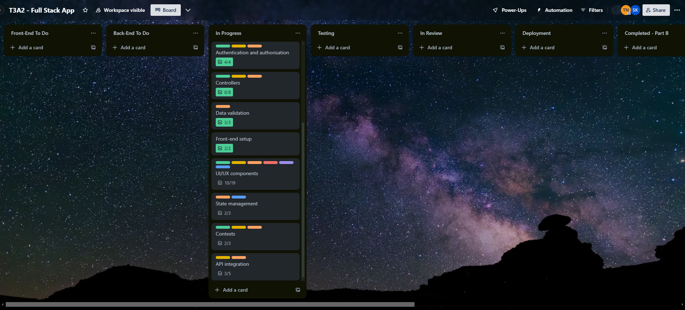 

#### 22.12
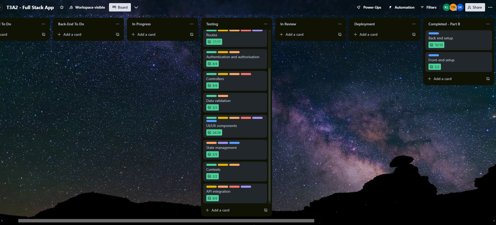    

